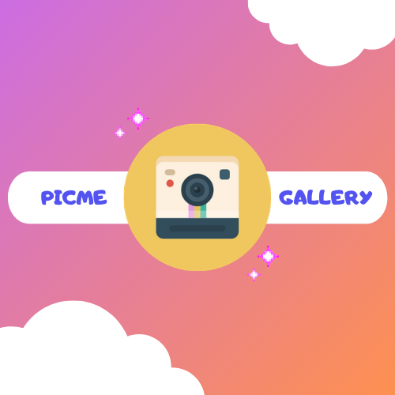

## Too Long Didn't Read (Short & Sweet Video Intro)

<iframe width="560" height="315" src="https://www.youtube.com/embed/tHq5ygjAuYQ?start=2" frameborder="0" allow="accelerometer; autoplay; clipboard-write; encrypted-media; gyroscope; picture-in-picture" allowfullscreen></iframe>

## Project Description
Have you ever gone on a trip, or to a party with friends, but forgot to take photos? Or did you forget ask your friends to send you photos from the event? 
Or have you ever come
home from an event with mostly photos of your friends or acquaintances, but with only a few grainy, questionable selfies of yourself? Are you tired of taking great photos of others, but not having any of your own to show off? Well fear no more, PicMe Gallery is the app for you.

PicMe Gallery, is an app that allows users who are out at an event, or who are traveling together to get access to a secure, cloud-based photo gallery via a shared password.

With PicMe Gallery in your pocket, you'll no longer have to beg your friends and family to share those photos with you, only to have
them send some mediocre ones where they look good, but you're blinking or looking slightly less-than-stellar.

PicMe Gallery's goal is to 
help family and friends seamlessly exchange photos they have of each other through a private-shared gallery that automatically populates from users' phones once an event is underway. Just join the event by entering the event name and password, set your phone to event mode (auto-uploading), and enjoy access to the event gallery for up to three days after the event. After that your photos are deleted from the online gallery, and you get to keep the ones you've downloaded.

No need to mess with iMessage, Messenger, WhatsApp, Facebook, or Google Photos. If you have access to the password for the event, just sign in, select your photos, download, and be on your way.

#### Key Functionality

* Automatic uploading of user photos to event gallery, once they're signed in with the event password.
* Camera-integration for ease of photo taking and sharing.
* Android gallery-style selection for intuitive downloading of shared photos.
* Photo captions, metadata, and the username of whomever uploaded the photo, will be available for event documentation and recollection purposes.
* Secure events-based gallery
* Auto-deletion of event info (including user and photo data) after three days for users' security

### Meet the PicMe Developer Team

## Alex Garber

> Alex hails from the ABQ. He likes BBQ. He is also a fishing, hunting, and spinning fire poi connoisseur.
Before this bootcamp he was the finest pet-store manager you've seen this side of the Mississippi.

> He is currently working on developing another android project to help you make the most of the ingredients
in your pantry. [Smart-Cheff](https://alex-garber.github.io/smart-cheff/) He spends his free time cooking crazy
recipes with his awesome girlfriend. She is the inspiration behind his app idea!

## Isaac Dominguez

> Isaac hails from San Jose, CA, but currently lives in Gallup, NM. He rides motorcycles, mad guitar riffs, and big trucks.
> In his life before becoming a developer, he worked as a highly skilled welder in the oil industry and showed his chops working under the baking sun in Carlsbad, NM.
> He never cracks underpressure.

> He is currently working on developing another android project to help you send a text from your phone in case of an emergency. 
> So if you fall off your motorcycle, get injured, or are somehow incapacitated, you'll be covered as long as your phone is within earshot.
> [Kidnapped App](https://shifdub.github.io/kidnapped/)

## Shayan Golafshani

> Shayan, has spent time teaching English in Japan. Karaage Chicken is probably the only thing he loves more than coding. He cycles, freestyle raps, and hopes to become
an amateur rally drifter on the side. He is avid about sustainability and planning for a livable future on Earth. 

> He is currently working on developing another android project to help you stay connected with your loved ones. Quite pertinent to the times, eh?
> [KiT](https://shayan-golafshani.github.io/keep-in-touch/)

## [Current implementation state](work/current-implementation.md)

## [Project Summary PDF](pdf/projectSummary.pdf)

 ## [License](work/license.md)

Copyright 2020 Shayan Golafshani, Isaac Dominguez, Alex Garber

Licensed under the Apache License, Version 2.0 (the "License");
you may not use this file except in compliance with the License.
You may obtain a copy of the License at

http://www.apache.org/licenses/LICENSE-2.0

Unless required by applicable law or agreed to in writing, software
distributed under the License is distributed on an "AS IS" BASIS,
WITHOUT WARRANTIES OR CONDITIONS OF ANY KIND, either express or implied.
See the License for the specific language governing permissions and
limitations under the License.

[//]: # (Geo-fencing seems pretty rad though!. Maybe we can eventually use it? https://developer.android.com/training/location/geofencing However, we don't want our app to be dependent on it.)

