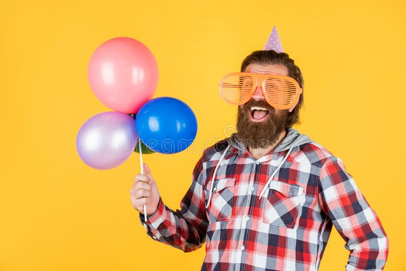
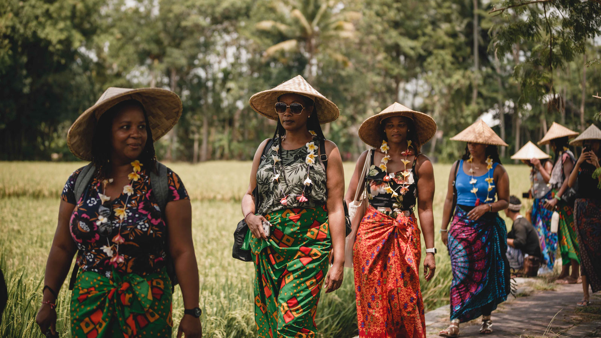
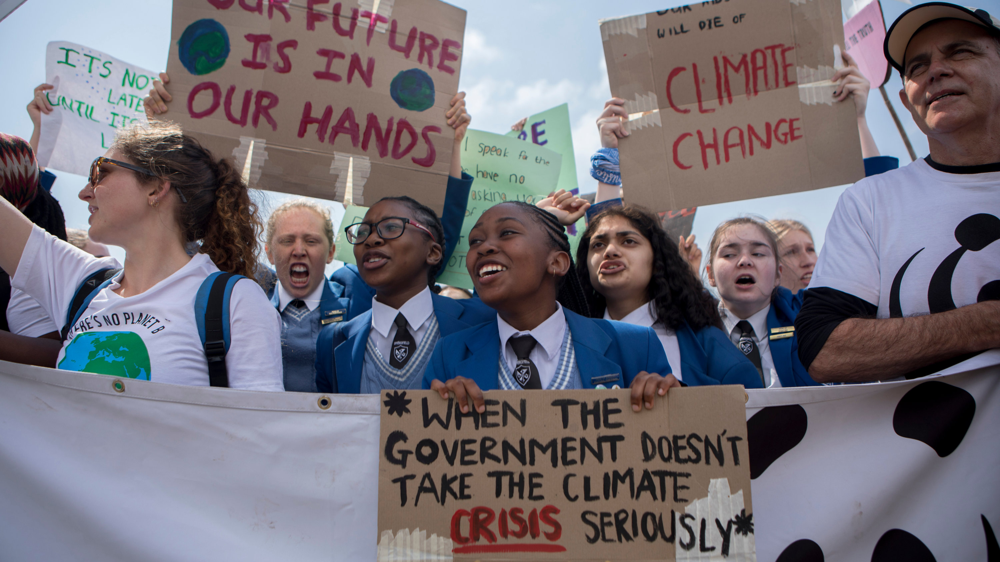
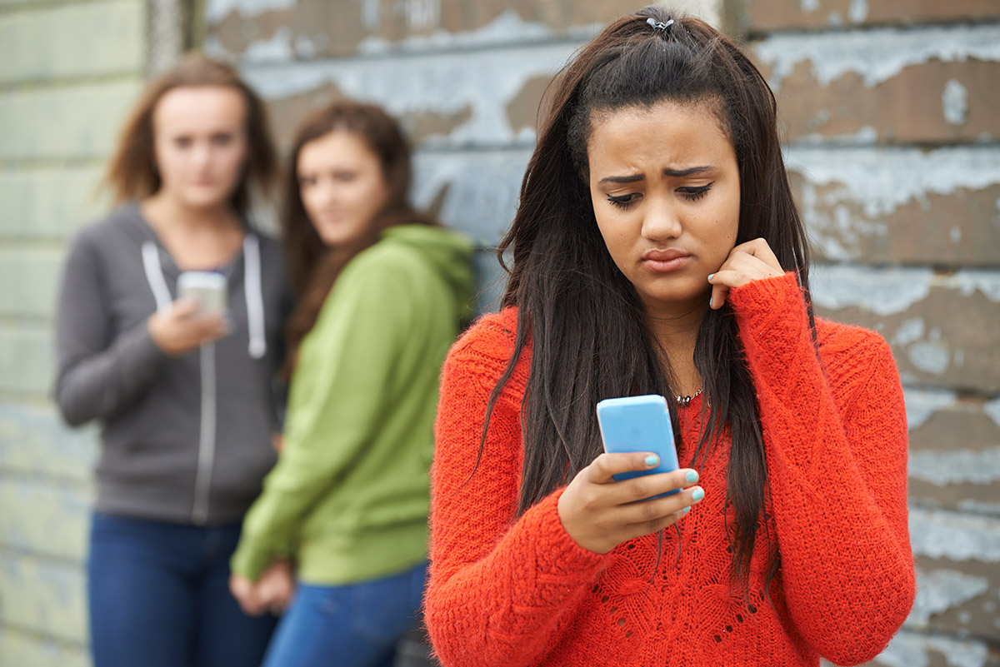

* People who go to many events like concerts, music festivals, state fairs, graduations, weddings, baby-showers, and birthday parties, etc.
> As an extroverted party-goer, I want to have an app that easily allows me to get access to the photos taken of me at a party or event, so that I can later upload them to social media and share them with my friends.

    

* People who travel frequently to new destinations, both nationally and internationally.
    > As someone who travels internationally and makes new friends with strangers during my travels, I want an app that seamlessly allows me to share the great photos I take of my new friends with them even if I forget to get their social media info or if we don't speak the same language. So that I can
share those photos with them, have a memento, and foster a deeper connection.

* People who are working on raising awareness around a cause or issue important to them and their local community.
    > As someone who is involved in local politics, I want an app that allows me to get access to the photos from all the people's camera rolls who attend local rallies and
protests such as those from the Black Lives Matter or Climate Strike movements. So that I can share and show photos that prove our cause to the media and journalists, whatever our cause may be.

* People who use online dating apps
    > As someone who is new to online dating, I want an app to help me get access to some nice candid photos of myself that my friends have taken in the past. So that I can more easily get dates, find love, and maybe a glimmer of hope during the pandemic.

* People who browse social media a lot, but don't post very often
    > As someone who browses social media often, but doesn't post much, I want an app that helps me get access to the photos my more social friends have taken of me during our adventures. So that I can have access to those nice photos of myself and feel comfortable to post them. 

